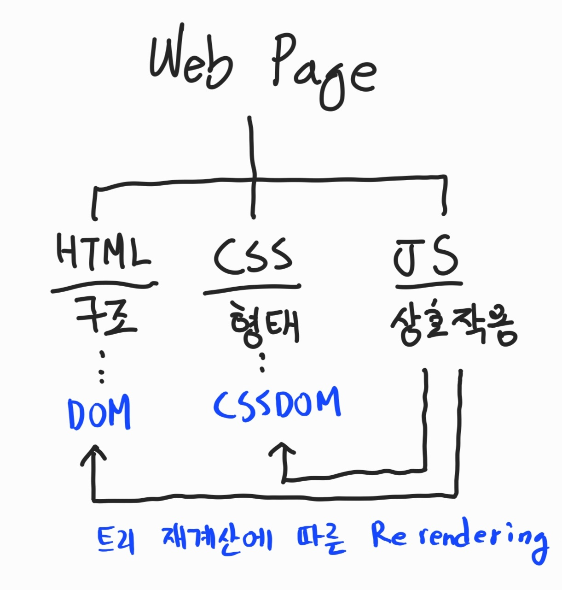
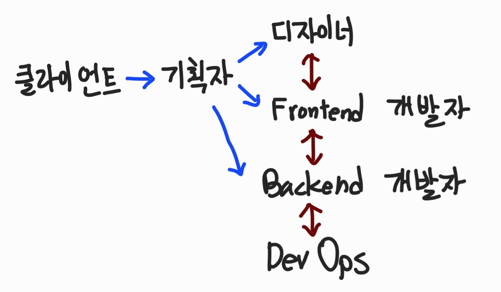

# 01-01. 웹 개요: 웹 개발은 무엇이며 왜 배우는가?

## 웹 개발을 배우는 이유?

우리는 일상적으로 인터넷을 사용하며 다양한 정보를 주고받는다. 인터넷에서 서비스를 이용하는 방식은 크게 앱과 웹으로 나뉜다. 앱은 특정 운영체제(OS)에서 실행되는 반면, 웹은 브라우저만 있으면 어디서든 실행 가능하다.

웹을 선택한 이유는 간단하다. 특정 운영체제나 기기에 종속되지 않고, 보편적인 기술로 서비스를 제공할 수 있기 때문이다. 물론 반응형 웹을 고려하면 모바일 환경까지 신경 써야 하지만, 여전히 웹이 더 범용적이다.

## 웹 개발은 무엇인가?

웹 개발은 기본적으로 웹 페이지에 무언가를 표시하는 일, 즉 렌더링 (Rendering)을 다루는 일이다. 이 과정에서 프론트엔드 개발자는 웹 페이지가 어떻게 화면을 구성할지 결정하고, 백엔드 개발자는 어떤 데이터를 가져와서 표시할지를 결정한다.

웹 페이지를 구성하는 핵심 요소는 3가지가 있다.

- HTML은 문서의 구조를 구성한다.
- CSS는 문서의 디자인 및 스타일을 설정한다.
- JavaScript는 사용자 입력 처리 및 동적인 화면 조작을 처리한다.

웹 페이지에 표시될 데이터는 단순한 정적인 내용이 아닐 수도 있다. 백엔드에서 데이터를 저장, 가공, 전송된 데이터를 웹 페이지에 가져와서 표시하기도 한다.

## 웹 개발은 누가 하는가?

웹 개발은 소위 웹 개발자만의 작업으로 끝나지 않는다.

- 기획자는 클라이언트가 요구하는 비즈니스 로직에 대해 정확하게 이해해야 한다. 때로는 클라이언트가 무엇을 원하게 될지에 대한 인사이트도 필요하다.
- 디자이너는 기획자의 설명에 따라 서비스의 화면을 그려낼 수 있어야한다. Figma 등 별도의 도구로 표현한 와이어 프레임, 디자인 등을 사용해 프론트엔드 개발자가 웹으로 구현해내야 한다.
- 데브옵스는 프론트엔드 개발자와 백엔드 개발자가 구현한 웹 애플리케이션이 배포될 수 있는 인프라 스트럭쳐를 프로비저닝 할 수 있어야한다. 또한 지속적인 통합, 지속적인 배포를 위한 파이프라인을 구성할 수 있어야 한다.
- 프로젝트에 따라서 데이터베이스 아키텍트, ERP 개발자, 사이트 안정성 엔지니어 등 다양한 직군의 사람이 참여하게 된다.

이 모든 직군의 사람이 올바른 의사소통의 체계를 갖추어야 고객의 요구사항에 맞는 서비스를 제공할 수 있다. 웹 개발은 각 클라이언트의 비즈니스를 구현하는데 최종 목적이 있기에, 납기일과 프로젝트의 품질이 가장 우선시 되어야한다. 이를 위해서는 모든 직군의 사람이 비즈니스 로직에 대한 일정한 이해도와 서로의 업무에 대한 개략적인 지식이 갖추어져야 한다.
